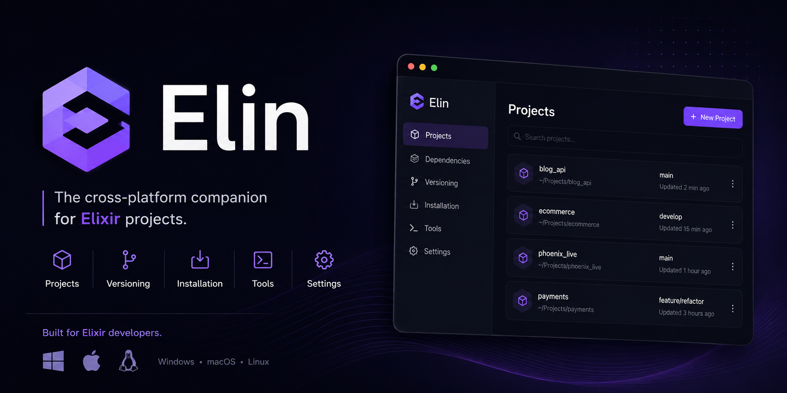

<p align="center">
  
</p>

<p align="center">
  <strong>The cross-platform companion for Elixir projects.</strong><br />
  Matching OTP · user PATH · editors · Mix studio · CLI<br />
  Same binary. No account.
</p>

<p align="center">
  <a href="https://github.com/belurgas/elin/releases/latest"></a>
  <a href="https://github.com/belurgas/elin/releases/latest"></a>
  <a href="https://github.com/belurgas/elin/releases/latest"></a>
  <a href="https://github.com/belurgas/elin/releases/latest"></a>
  <a href="LICENSE"></a>
</p>

<p align="center">
  <a href="https://github.com/belurgas/elin/releases/latest">Download</a>
  · <a href="#studio">Studio</a>
  · <a href="#cli">CLI</a>
  · <a href="TRANSLATING.md">Translate</a>
  · <a href="ROADMAP.md">Roadmap</a>
</p>

---

A clean machine still makes Elixir a scavenger hunt: the language site, a zip, a *compatible* Erlang, PATH, Hex, then which of twelve VS Code extensions is real. Mix cannot find `erl` and twenty minutes are gone.

Elin installs a matching Elixir + OTP pair, finds the editor you already use, writes **user** PATH (no admin), and opens the Mix project in a studio with a live module graph.

English and Russian in the UI. The only network calls are Hex Bob, GitHub (OTP + Elin releases), and hex.pm.

## Install

Pick the asset for your OS from [Releases](https://github.com/belurgas/elin/releases/latest):

| OS | Package |
| --- | --- |
| **Windows 10 / 11 x64** | NSIS `.exe` (or `.msi` if you prefer WiX). Current user, no admin. |
| **macOS 12+** | `.dmg` — Apple Silicon (`aarch64`) or Intel (`x86_64`). |
| **Linux x64** | `.AppImage`, `.deb`, or `.rpm`. |

Then:

1. Open Elin → **Install recommended** if this machine has no Elixir yet.
2. Optional: Doctor → add `elin` to PATH, then a *new* terminal can run `elin -h`.

The app checks GitHub Releases on launch and once an hour. An update is never installed until you click **Install update**.

OTP comes from the same places as [`install.sh`](https://elixir-lang.org/install/): GitHub Windows zips, [erlef/otp_builds](https://github.com/erlef/otp_builds) on macOS, Hex Bob Ubuntu tarballs on Linux. Elixir is always the Hex Bob zip. Layout on disk matches `~/.elixir-install/installs`.

## What you get

| | |
| --- | --- |
| **Pairing** | Live catalog from [Hex Bob](https://builds.hex.pm/builds/elixir/builds.txt) and the OTP source for this OS. Newest stable Elixir, then a **compatible** OTP major. Elixir 1.20 will not land on OTP 24. |
| **PATH** | Current-user only. Windows: `HKCU\Environment`. macOS / Linux: `~/.elixir-install/env.sh` sourced from your shell profile. Switching the active pair rewrites Elin-managed entries. |
| **Editors** | VS Code, Cursor, VSCodium, Windsurf, IntelliJ, WebStorm, Neovim, Zed, Sublime, Emacs, Helix. One default. One-click ElixirLS for the VS Code family. |
| **Doctor** | Elixir, `erl`, Mix, Hex, Git (and VC++ on Windows). One button when the binary is on disk but missing from a new console. |
| **Projects** | `mix new`, supervisor, Phoenix, LiveView. Kits (Credo, Sobelow, …) patch `mix.exs` without stomping a file you already tuned. |
| **Hex Radar** | Search, downloads, docs. In Studio: add/remove the dep and `mix deps.get`. |
| **Playground** | Snippet on disk, 8 second cap, 16 KB max. Nothing uploaded. |

Pin a pair globally, or pin one Mix project to its own Elixir.

## Studio

Open a Mix app from Projects. You get a workspace window — graph, Hex, git, quality, console — not a settings page with extra steps.

Modules as a force layout. Roles have their own color (GenServer, LiveView, supervisor, schema, router, test). Git-dirty nodes get a ring. Right-click a node or a row in the module tree: open at line, copy, reveal in the file manager.

Notes are `# elin:note` in the source. The graph stays mounted when you switch tabs.

- **Git** — changed files as a tree. `new` / `edited` / `deleted`. Commit. Init + `.gitignore` + license if needed.
- **Quality** — Credo, format, Hex audit, MixAudit, Sobelow, Dialyzer. Scan writes a report; kits patch `mix.exs`.
- **Console** — type `mix test`, `git status`, `elin -h`. Mix streams into the tab.

## CLI

Same `elin` binary as the GUI. No args opens (or focuses) the app.

```
elin add [path]      remember this Mix project
elin list
elin open [path]     Studio workspace
elin scan [path]     modules, git, Mix tools
elin scan --full     also Dialyzer and tests
elin format [path]   mix format   (--check to report only)
elin kit list | add credo | remove credo
elin status [path]
elin path            put this elin binary on the user PATH
```

## Translate

Settings has a language dropdown. It applies to every window.

To add a language: copy `src/i18n/en.ts`, translate the values, register it in `src/i18n/index.ts`, open a PR. Step by step: [TRANSLATING.md](TRANSLATING.md).

## Develop

```bash
git clone https://github.com/belurgas/elin.git
cd elin
npm install
npm run tauri dev
```

```bash
npx tsc --noEmit
npm run test:rust
npm run tauri build
```

Linux also needs WebKit: `libwebkit2gtk-4.1-dev librsvg2-dev patchelf`. Icons and installer bitmaps are generated from `docs/logo.png`:

```bash
python -m pip install Pillow
npm run brand
```

| Folder | |
| --- | --- |
| [`src/`](src/README.md) | UI, Studio, i18n |
| [`src-tauri/`](src-tauri/README.md) | Install, PATH, Mix, git, updates |
| [`src/i18n/`](TRANSLATING.md) | One file per language |

Bug or idea → [Issues](https://github.com/belurgas/elin/issues). Templates ask for OS, Elin version, and what you clicked. Do not paste secrets from `.env`.

## Security

- Network: Hex Bob, GitHub OTP / otp_builds, hex.pm, Elin's own Releases. Playground code stays on disk.
- PATH edits are current-user only.
- Zip extract uses `enclosed_name()` (no zip-slip).
- Studio shell runs in the project folder with the pinned toolchain. Treat it like a terminal.

## License

MIT. Elixir and Erlang are trademarks of their holders. Elin is an independent companion, not an official installer.
